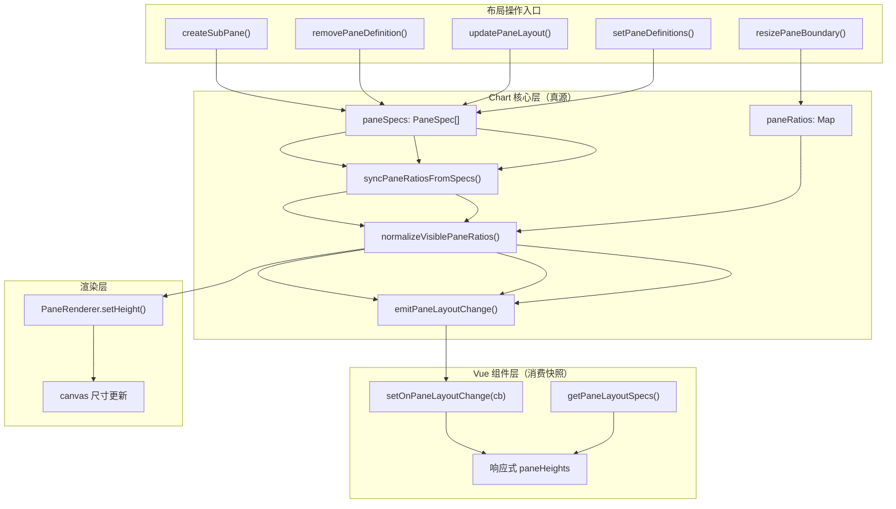
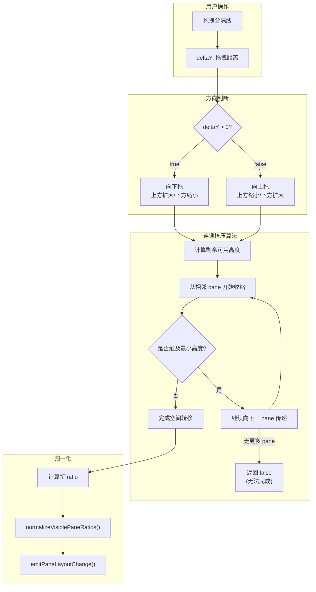
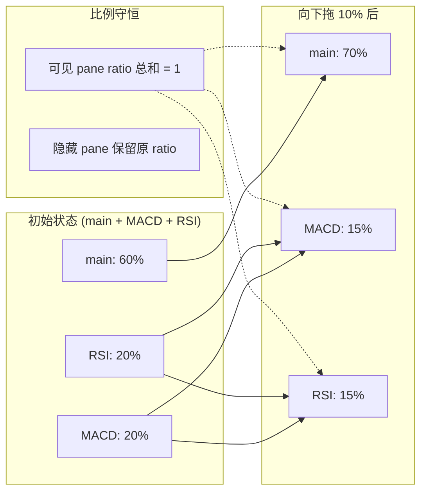

# 图表架构重构说明（Pane 统一抽象与单向数据流）

> 时间：2026-05  
> 范围：`Chart` / `Interaction` / Renderer Plugin 调度 / Vue 对接层

## 1. 背景与目标

本轮重构聚焦三件事：

1. 统一主图/副图模型，消除 `main/sub` 双轨分支。
2. 建立 `Chart -> UI` 单向布局数据流，避免 ratio 回写环。
3. 用 `role/capabilities` 取代硬编码分支，提升扩展一致性。

对应收益：
- 新增 pane 或调整顺序时不再依赖“是否 main”的特殊路径；
- 布局比例由核心统一归一化，UI 只消费快照；
- 渲染、交互、插件 resize 语义对齐，回归点可测试化。

---

## 2. 架构决策

### 2.0 Pane 单向数据流



### 2.1 Pane 统一抽象

`PaneSpec` 扩展为语义化模型（`src/core/chart.ts`）：
- `role?: 'price' | 'indicator'`
- `capabilities?: Partial<PaneCapabilities>`

`Chart.initPanes()` 会把 spec 转为统一 `Pane` 实例，并同步到渲染器管理器已知 pane 集合。

### 2.2 单向布局数据流

新增布局回流能力：
- `setOnPaneLayoutChange(cb)`
- `getPaneLayoutSpecs()`
- `emitPaneLayoutChange()`

约束：
- UI 不再维护独立 ratio 真源；
- `updatePaneLayout/setPaneDefinitions/upsertPane/removePaneDefinition` 均经 `applyPaneLayoutSpecs()` 进入统一归一化流程。

### 2.3 行为由 capability 驱动

```mermaid
graph TB
    subgraph PaneModel[“Pane 模型”]
        P1[“id: string”]
        P2[“role: 'price' | 'indicator'”]
        P3[“capabilities: PaneCapabilities”]
    end

    subgraph Capabilities[“PaneCapabilities”]
        C1[“candleHitTest: boolean”]
        C2[“showPriceAxisTicks: boolean”]
        C3[“supportsPriceTranslate: boolean”]
        C4[“showCrosshairPriceLabel: boolean”]
    end

    subgraph Behaviors[“行为判定点”]
        B1[“交互命中测试”]
        B2[“Y轴刻度绘制”]
        B3[“价格平移”]
        B4[“十字线价格标签”]
    end

    P3 --> C1 & C2 & C3 & C4

    C1 -->|true| B1
    C1 -->|false| B1
    C2 --> B2
    C3 --> B3
    C4 --> B4

    style P2 fill:#e1f5fe
    style C1 fill:#fff3e0
```

替换”主图/副图硬编码分支”为 capability 判定：
- 交互 candle 命中：`pane.capabilities.candleHitTest`
- Y 轴刻度：`pane.capabilities.showPriceAxisTicks`
- 价格平移：`pane.capabilities.supportsPriceTranslate`
- 十字线价格标签：`pane.capabilities.showCrosshairPriceLabel`

### 2.4 插件调度语义收敛

`RendererPluginManager` 修正 unknown pane 请求路径：
- 对未知 paneId 动态合并 `pane-local + global`，并缓存结果；
- `getRenderers()` 仍排除 `isSystem`；
- `renderPlugin(name)` 仍允许系统渲染器按名独立绘制；
- `notifyResize()` 仅通知已启用渲染器。

---

## 3. 关键行为变化

### 3.0 边界拖拽与连锁挤压





### 3.1 初始比例策略

`createSubPane()` 采用统一权重策略：
- 仅存在一个 price pane 时：`price=3`，每个 indicator `=1`；
- 归一化后 `main + MACD + RSI` 为约 `0.6 / 0.2 / 0.2`。

### 3.2 边界拖拽比例守恒

`resizePaneBoundary()` 在相邻 pane 对内重分配 ratio，再对可见 pane 做归一化，保证可见 ratio 和恒为 1。

### 3.3 隐藏 pane 不参与可见归一化

`syncPaneRatiosToSpecs()/getPaneLayoutSpecs()` 仅用 visible pane 参与可见 sum；隐藏 pane 保留自身 ratio，不影响当前可见布局。

---

## 4. 对外 API 影响

新增/强化 API（`src/core/chart.ts`）：
- `setPaneDefinitions(defs)`
- `upsertPane(def)`
- `removePaneDefinition(paneId)`
- `bindIndicatorToPane(paneId, indicatorId, params?)`
- `setOnPaneLayoutChange(cb)`
- `getPaneLayoutSpecs()`

兼容性说明：
- 既有 `createSubPane/removeSubPane/clearSubPanes` 仍可用；
- 语义化配置层与 UI 层应优先使用“定义 + 回流”模式，而非本地 ratio 反向覆盖。

---

## 5. 回归测试覆盖

本轮新增/补齐测试：

1. `src/plugin/__tests__/plugin.test.ts`
   - unknown pane fallback 合并
   - pane/global 同优先级顺序
   - system renderer 可见性语义
   - resize 仅通知启用渲染器

2. `src/core/renderers/__tests__/yAxis.renderer.test.ts`
   - capability 控制刻度渲染
   - `yAxisCtx` 优先路由与 `ctx` 回退
   - crosshair 标签渲染条件

3. `src/core/controller/__tests__/interaction.dpr.test.ts`
   - 副图不参与 candle hit test
   - 主图命中时 `hoveredIndex === crosshairIndex`
   - 主图 -> 副图移动后 `hoveredIndex` 清空

4. `src/core/__tests__/chart.dpr.test.ts`
   - `main+MACD+RSI` 初始 3:1:1
   - 两个副图等高（允许像素舍入误差）
   - 边界拖拽后 ratio 守恒
   - 非法 resize 输入不改布局
   - hidden pane 不参与 visible 归一化

---

## 6. 迁移建议

1. 新增 pane 行为时，先定义 `role + capabilities`，避免新增 `id === 'main'` 分支。
2. 任何布局写入统一走 `Chart` API，UI 只监听 `setOnPaneLayoutChange`。
3. 插件若依赖 pane 语义，优先读取 `pane.role/capabilities`，不要猜测 paneId 前缀。
4. 修改布局算法后，至少回归：
   - 初始 3:1:1
   - indicator 等高
   - resize ratio 守恒

---

## 7. 关键代码索引

- `src/core/chart.ts`
- `src/components/KLineChart.vue`
- `src/core/controller/interaction.ts`
- `src/core/renderers/yAxis.ts`
- `src/plugin/rendererPluginManager.ts`
- `src/plugin/types.ts`

该文档描述的是本轮重构后的目标语义；后续若继续调整布局算法或 pane 能力模型，请同步更新本文件与回归用例。
