# 渲染引擎架构技术分析文档

> 项目: `@363045841yyt/klinechart` v0.5.0-alpha.2
> 分析日期: 2026-05-10
> 分析范围: `src/core/`, `src/plugin/`, `src/semantic/`, `src/components/`

---

## 1. 渲染架构分层

系统采用五层架构，自上而下职责清晰分离：

```mermaid
graph TB
    subgraph VueLayer["Vue 组件层 (KLineChart.vue)"]
        direction LR
        V1["zoomLevel 响应式状态<br/>(SSOT)"]
        V2["DOM 容器管理"]
        V3["用户交互事件代理"]
    end

    subgraph OrchestrationLayer["编排层 (Chart 类 - core/chart.ts)"]
        direction LR
        O1["computeViewport()<br/>视口计算"]
        O2["getVisibleRange()<br/>可见范围裁剪"]
        O3["calcKLinePositions()<br/>K线坐标预计算"]
        O4["scheduleDraw()<br/>RAF 帧调度"]
    end

    subgraph PluginDispatchLayer["插件调度层 (RendererPluginManager)"]
        direction LR
        P1["渲染器注册/注销"]
        P2["优先级排序 + 缓存"]
        P3["错误隔离 (try/catch)"]
    end

    subgraph RendererLayer["渲染器层 (src/core/renderers/)"]
        direction LR
        R1["candle.ts<br/>烛图"]
        R2["gridLines.ts<br/>网格线"]
        R3["ma.ts / macd.ts<br/>技术指标"]
        R4["crosshair.ts<br/>十字线"]
        R5["yAxis.ts / timeAxis.ts<br/>坐标轴"]
    end

    subgraph InfraLayer["基础设施层"]
        direction LR
        I1["pixelAlign.ts<br/>物理像素对齐"]
        I2["PriceScale<br/>价格-坐标变换"]
        I3["viewport.ts<br/>可见范围计算"]
    end

    VueLayer -->|"onViewportChange<br/>onInteractionChange<br/>scheduleDraw()"| OrchestrationLayer
    OrchestrationLayer -->|"RenderContext<br/>(ctx, pane, data,<br/>range, dpr...)"| PluginDispatchLayer
    PluginDispatchLayer -->|"draw(context)<br/>按优先级调度"| RendererLayer
    RendererLayer -->|"roundToPhysicalPixel<br/>alignToPhysicalPixelCenter<br/>priceToY"| InfraLayer

    style VueLayer fill:#e8f4fd,stroke:#2196F3
    style OrchestrationLayer fill:#e8f5e9,stroke:#4CAF50
    style PluginDispatchLayer fill:#fff3e0,stroke:#FF9800
    style RendererLayer fill:#fce4ec,stroke:#E91E63
    style InfraLayer fill:#f3e5f5,stroke:#9C27B0
```

**架构时序图** -- 单帧渲染的完整调用链：

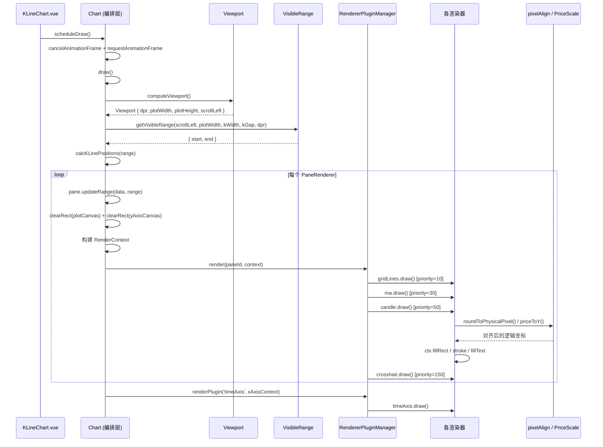

**各层职责说明：**

- **Vue 组件层** (`src/components/KLineChart.vue`, 约 1557 行)：管理 zoomLevel 响应式状态（SSOT），创建 DOM 容器，注册所有渲染器插件，将用户交互事件转发给 InteractionController。
- **编排层** (`src/core/chart.ts`, 约 1252 行)：`Chart` 类是核心中枢。每次 `draw()` 执行：计算视口 -> 裁剪可见数据范围 -> 预计算每根 K 线 X 坐标 -> 遍历所有 PaneRenderer，构建 `RenderContext`，交给 RendererPluginManager 调度绘制。
- **插件调度层** (`src/plugin/rendererPluginManager.ts`)：维护渲染器注册表，按 `paneId` 分组 + 优先级排序，渲染时逐个调用 `draw()`，每个渲染器异常互不传染。
- **渲染器层** (`src/core/renderers/`)：各渲染器只关心自身绘制逻辑，接收统一的 `RenderContext`，通过 `ctx.fillRect/stroke/fillText` 等 Canvas API 输出图形。
- **基础设施层**：`pixelAlign.ts` 提供物理像素对齐函数，`PriceScale` 管理 Y 轴价格-像素映射，`viewport.ts` 计算可见数据范围。

**关键设计特征：**
- 编排层与渲染器层之间通过 `RenderContext` 解耦，渲染器无状态、无副作用
- Zoom 状态所有权在 Vue 层，Chart 只消费不持有（Vue SSOT 模式）
- 每个 Pane 拥有独立的 `plotCanvas` + `yAxisCanvas`，互不干扰

---

## 2. 数据流

数据从外部 API 到屏幕像素的完整路径：

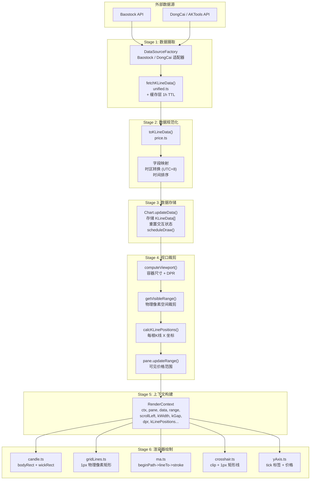

**数据摄取时序图：**

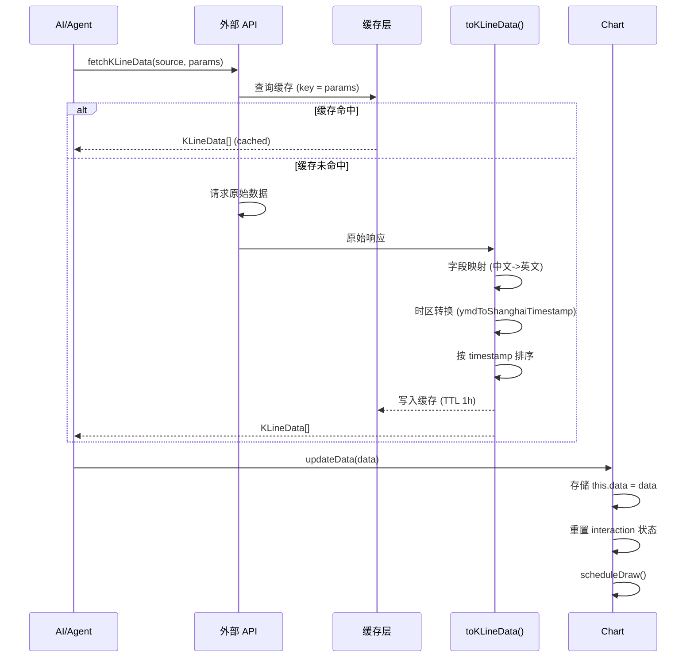

**渲染帧数据变换时序图：**

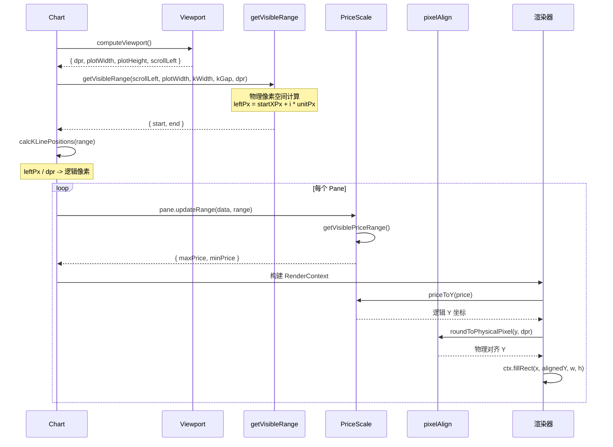

**数据流中的关键转换点：**

1. **外部数据 -> KLineData**：不同数据源（Baostock / 东财）通过适配器统一为 `KLineData` 接口
2. **KLineData -> 可见范围**：`getVisibleRange()` 在物理像素空间计算，避免浮点误差
3. **价格 -> Y 坐标**：`PriceScale.priceToY()` 应用 verticalScale + priceOffset 变换
4. **数据索引 -> X 坐标**：`startXPx + dataIndex * unitPx` 在物理像素空间计算，再除以 dpr 得逻辑坐标
5. **逻辑坐标 -> 物理对齐坐标**：`roundToPhysicalPixel()` / `alignToPhysicalPixelCenter()` 确保清晰渲染

**状态管理模式：**

| 状态 | 持有者 | 读取者 |
|------|--------|--------|
| zoomLevel | Vue ref (SSOT) | Chart.draw() |
| kWidth / kGap | Vue computed (派生) | Chart.draw() -> RenderContext |
| 交互状态 | InteractionController | Vue (通过 getInteractionSnapshot) |
| 指标共享状态 | StateStore | Scale 渲染器 (通过 getSharedState) |
| Pane 高度比 | Chart.paneRatios Map | layoutPanes() |
| 自定义标记 | MarkerManager | customMarkers.ts 渲染器 |

---

## 3. 图元系统

项目采用**双层图元体系**：

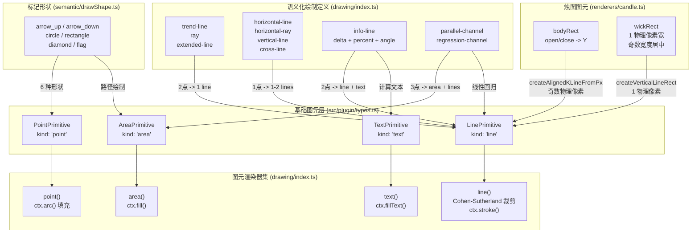

### 3.1 绘制注释图元（用户标注工具）

定义于 `src/plugin/types.ts`，共 4 种基础图元：

| 图元类型 | 接口 | 描述 |
|---------|------|------|
| PointPrimitive | `{ kind: 'point', point, role?, style? }` | 屏幕坐标点（圆形） |
| LinePrimitive | `{ kind: 'line', a, b, extend?, style? }` | 线段，可选无限延长 |
| AreaPrimitive | `{ kind: 'area', points[], closed, style? }` | 填充多边形 |
| TextPrimitive | `{ kind: 'text', point, text, align?, style? }` | 文本标签 |

图元组合为 `DrawingGeometry = { primitives[], bounds?, meta? }`。

**图元渲染器集** (`src/core/drawing/index.ts` `createDefaultPrimitiveRendererSet()`)：
- `point()` -- `ctx.arc()` 填充圆
- `line()` -- Cohen-Sutherland 视口裁剪 + `ctx.stroke()` + 可选端点圆
- `area()` -- `ctx.fill()` 填充多边形
- `text()` -- `ctx.fillText()` 文本渲染

### 3.2 语义化绘制定义

10 种绘制类型通过 `DrawingDefinition.compute()` 将锚点数据（价格-时间空间）转换为屏幕空间图元：

| 绘制类型 | 锚点数 | 输出图元 |
|---------|--------|---------|
| trend-line | 2 | line (无延长) |
| ray | 2 | line (右延长) |
| extended-line | 2 | line (双向延长) |
| horizontal-line | 1 | line (水平双向) |
| horizontal-ray | 1 | line (水平右延长) |
| vertical-line | 1 | line (垂直双向) |
| cross-line | 1 | 2 lines (十字) |
| info-line | 2 | line + text (差值/百分比/角度) |
| parallel-channel | 3 | area + 5 lines |
| regression-channel | 2 | 3 lines (线性回归 + sigma 带) |

### 3.3 语义化标记形状

`src/semantic/drawShape.ts` 提供 6 种标记形状：`arrow_up`, `arrow_down`, `circle`, `rectangle`, `diamond`, `flag`，各带 hitTest 函数用于交互检测。

### 3.4 烛图图元

`candle.ts` 渲染器将每根 KLineData 分解为：
- 实体矩形 (bodyRect)：open/close 映射的 Y 范围
- 上影线矩形 (upper wick)：high -> body top，1 物理像素宽
- 下影线矩形 (lower wick)：body bottom -> low，1 物理像素宽

通过 `createAlignedKLineFromPx()` 强制实体宽度为奇数物理像素，确保影线完美居中。

---

## 4. 渲染器系统

### 4.1 渲染器接口

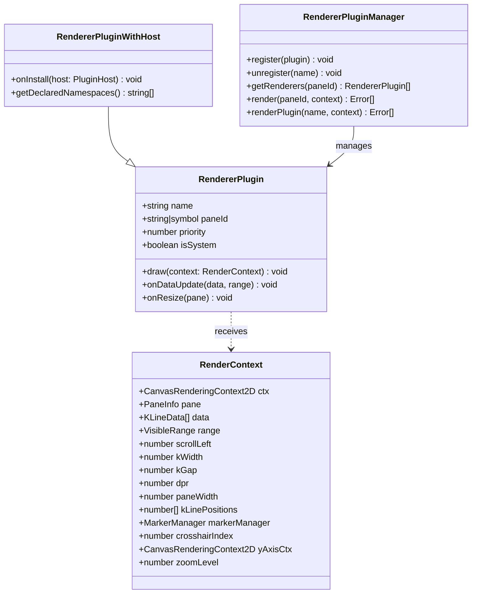

`RenderContext` 是渲染器与编排层之间的统一契约：

```typescript
interface RenderContext {
  ctx: CanvasRenderingContext2D
  pane: PaneInfo
  data: KLineData[]
  range: VisibleRange
  scrollLeft: number
  kWidth: number
  kGap: number
  dpr: number
  paneWidth: number
  kLinePositions: number[]
  markerManager: MarkerManager
  crosshairIndex: number
  yAxisCtx?: CanvasRenderingContext2D
  zoomLevel: number
  viewport: { scrollLeft, plotWidth, plotHeight }
}
```

### 4.2 渲染优先级

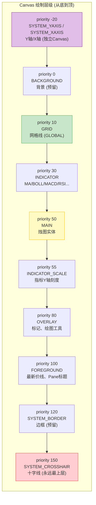

**单帧渲染调度时序图 (含错误隔离)：**

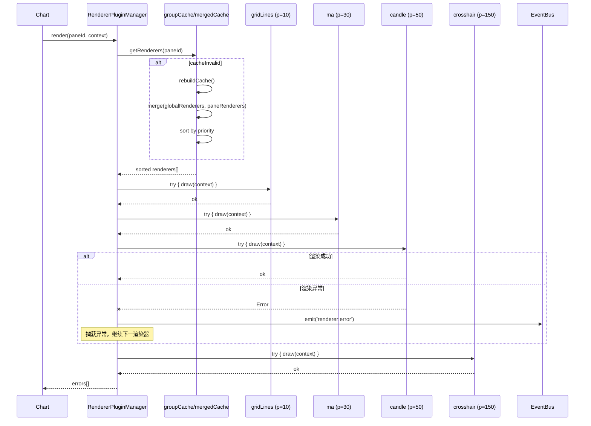

### 4.3 渲染器清单

**主图渲染器 (main pane)：**
- `candle.ts` (priority 50) -- 烛图实体 + 影线 + 量价关系三角标记
- `gridLines.ts` (priority 10, GLOBAL) -- 水平线（等距）+ 垂直线（月边界）
- `lastPrice.ts` (priority 100) -- 最新收盘价虚线
- `extremaMarkers.ts` (priority 80) -- 可见范围最高/最低价标记
- `customMarkers.ts` (priority 80) -- 用户自定义标记
- `ma.ts` / `boll.ts` / `expma.ts` / `ene.ts` (priority 30) -- 主图叠加指标
- `mainIndicatorLegend.ts` (priority 55) -- 主图指标图例
- `paneTitle.ts` (priority 100) -- Pane 标题栏
- `yAxis.ts` (priority -20, system) -- 价格轴刻度 + 最新价标签
- `crosshair.ts` (priority 150, system) -- 十字光标

**子图渲染器 (sub panes, 动态创建)：**
- `subVolume.ts` (priority 30) -- 成交量柱状图
- `macd.ts` (priority 30) -- MACD (DIF线 + DEA线 + 柱状图)
- `rsi.ts` / `cci.ts` / `stoch.ts` / `mom.ts` / `wmsr.ts` / `kst.ts` / `fastk.ts` (priority 30) -- 各振荡器
- 每个指标对应一个 Scale 渲染器 (priority 55) -- 读取 StateStore 共享状态绘制Y轴

**独立渲染：**
- `timeAxis.ts` (system, isSystem: true) -- 时间轴，通过 `renderPlugin()` 单独调用，绘制在独立的 xAxisCanvas 上

### 4.4 帧调度机制

```typescript
scheduleDraw() {
  if (this.raf != null) cancelAnimationFrame(this.raf)
  this.raf = requestAnimationFrame(() => {
    this.raf = null
    this.draw()
  })
}
```

多次 `scheduleDraw()` 调用在同一帧内合并为一次 `draw()`，避免重复渲染。渲染器管理器的 `setInvalidateCallback()` 确保插件注册/注销/启用/禁用/配置变更时自动触发重绘。

### 4.5 错误隔离

每个渲染器的 `draw()` 调用被 `try/catch` 包裹，异常不会导致整帧崩溃。错误事件通过 `renderer:error` 发出，由 Vue 层监听处理。

### 4.6 插件列表缓存

`RendererPluginManager` 内部维护两级缓存：
- `groupCache`：按 paneId 分组 + 优先级排序
- `mergedCache`：全局渲染器与 pane 专属渲染器的 O(n) 归并结果
- `cacheInvalid` 标志控制惰性重建

---

## 5. 插件系统

### 5.1 双层插件架构

项目包含两个独立但互补的插件体系：

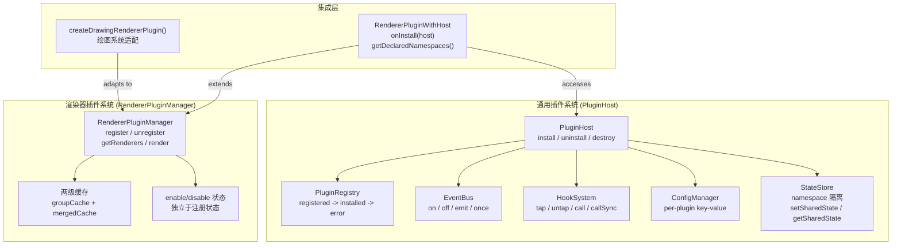

**通用插件系统 (PluginHost)：**
- 文件：`src/plugin/PluginHost.ts`, `PluginRegistry.ts`, `EventBus.ts`, `HookSystem.ts`, `ConfigManager.ts`, `StateStore.ts`
- 生命周期：`registered -> installed -> (error)`
- 提供：事件总线 (pub/sub)、Hook 管道 (tap/call, 优先级排序)、配置管理 (per-plugin key-value)、共享状态存储 (namespace 隔离)

**渲染器插件系统 (RendererPluginManager)：**
- 文件：`src/plugin/rendererPluginManager.ts`, `src/plugin/types.ts`
- 专注于渲染器的注册、分组、排序、调度
- 支持 `RendererPluginWithHost` 扩展接口，允许渲染器访问 PluginHost 的事件/Hook/状态系统

### 5.2 通用插件生命周期

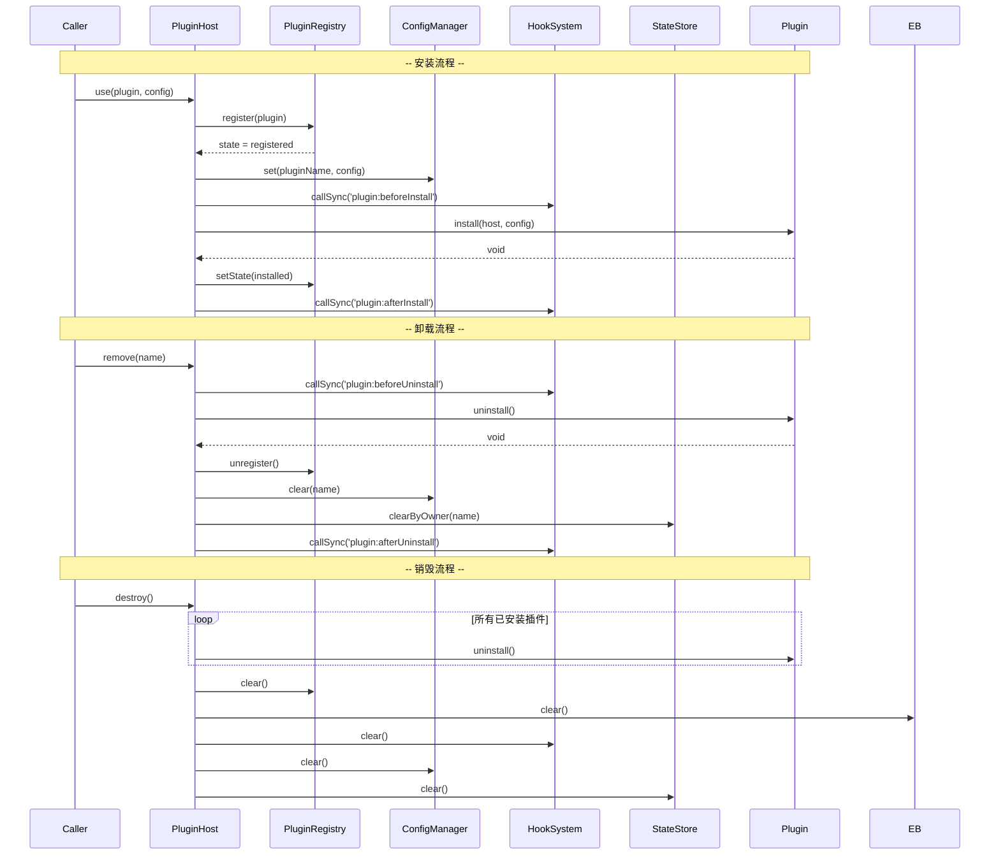

```
host.use(plugin, config)
  -> PluginRegistry.register()    // state = registered
  -> ConfigManager.set()          // 存储配置
  -> HookSystem.call('plugin:beforeInstall')
  -> plugin.install(host, config) // 调用安装函数
  -> state = installed
  -> HookSystem.call('plugin:afterInstall')

host.remove(name)
  -> HookSystem.call('plugin:beforeUninstall')
  -> plugin.uninstall()
  -> PluginRegistry.unregister()
  -> ConfigManager.clear()
  -> StateStore.clearByOwner()    // 清理共享状态
  -> HookSystem.call('plugin:afterUninstall')
```

### 5.3 Hook 系统

支持同步和异步两种调用模式：
- `tap(name, fn, priority)`：注册钩子，priority 越小越先执行
- `call(name, context)`：异步链式调用
- `callSync(name, context)`：同步顺序调用
- 内置生命周期 Hook：`plugin:beforeInstall`, `plugin:afterInstall`, `plugin:beforeUninstall`, `plugin:afterUninstall`

### 5.4 状态共享机制 (StateStore)

命名空间隔离的共享状态，用于指标渲染器与 Scale 渲染器之间的数据传递：

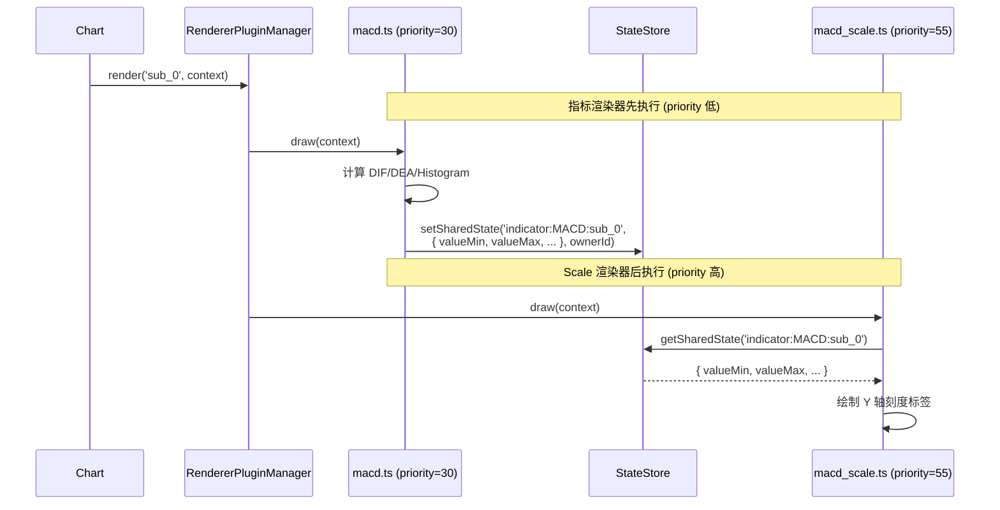

```typescript
// 指标渲染器写入
pluginHost.setSharedState('indicator:MACD:sub_0', { valueMin: -0.5, valueMax: 1.2 }, ownerId)

// Scale 渲染器读取
const state = pluginHost.getSharedState('indicator:MACD:sub_0')
```

State 键名规范定义于 `src/plugin/stateKeys.ts`，格式为 `indicator:{type}:{paneId}`。

### 5.5 绘图工具插件集成

`createDrawingRendererPlugin()` (`src/core/drawing/plugin.ts`) 将绘图系统适配为标准的 RendererPlugin：
- 注册在 priority 80 (OVERLAY)
- `draw()` 中将 `DrawingObject` 锚点通过 `toScreen()` 转换为屏幕坐标
- 通过 `DrawingDefinitionRegistry` 计算图元几何
- 通过 `PrimitiveRendererSet` 渲染各图元类型

---

## 6. 布局定位系统

### 6.1 Pane 布局模型

图表由多个垂直堆叠的 **Pane** 组成：

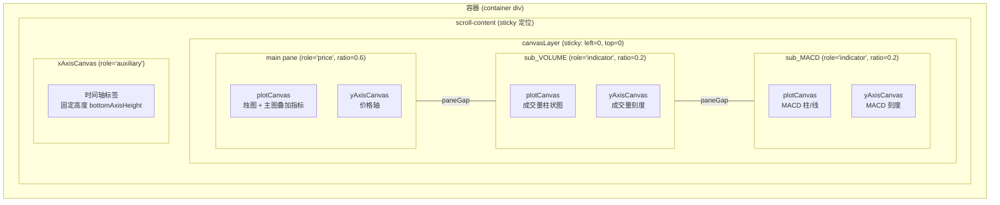

**Pane 类结构：**

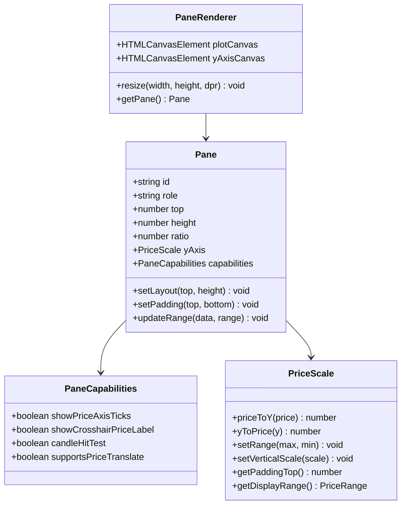

每个 Pane 的属性：
- `id`: 标识符 (`'main'`, `'sub_VOLUME'`, `'sub_MACD'`...)
- `role`: `'price'` | `'indicator'` | `'auxiliary'`
- `ratio`: 高度占比 (归一化到 1)
- `top`: 距绘图区顶部的偏移 (逻辑像素)
- `height`: 高度 (逻辑像素)
- `yAxis`: `PriceScale` 实例
- `capabilities`: 行为控制标志位

### 6.2 布局算法 (`Chart.layoutPanes()`)

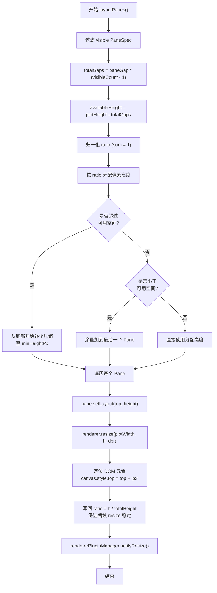

```
1. 过滤可见 PaneSpec
2. 总间隙 = paneGap * (可见数 - 1)
3. 可用高度 = plotHeight - 总间隙
4. 归一化 ratio
5. 按 ratio 分配像素高度
6. 执行最小高度约束
7. 超出可用空间时从底部开始压缩
8. 不足时余量给最后一个 Pane
9. 对每个 Pane: pane.setLayout(y, h), resize canvas, 定位 DOM
10. 将实际像素高度写回 ratio (保证后续 resize 稳定)
```

### 6.3 Pane 边界拖拽

`resizePaneBoundary()` (`chart.ts` lines 648-732) 支持级联压缩：拖动边界时相邻 Pane 被压缩到最小高度后，压缩继续向更远的 Pane 传播。调整后重新计算 ratio、归一化、重新布局。

### 6.4 坐标系统

**物理像素空间 (内部计算)：**
- K 线定位：`leftPx = startXPx + dataIndex * unitPx` (整数物理像素)
- 可见范围：`start = floor((scrollLeftPx - startXPx) / unitPx) - 1`
- K 线宽度：强制奇数物理像素 (`if (kWidthPx % 2 === 0) kWidthPx += 1`)
- K 线间隙：恒定 3 物理像素 (`kGap = 3 / dpr`)

**逻辑像素空间 (Canvas 绑制)：**
- 通过 `ctx.scale(dpr, dpr)` 将坐标空间缩放到逻辑像素
- 所有渲染器在逻辑坐标系中绘制
- 关键坐标通过 `roundToPhysicalPixel()` / `alignToPhysicalPixelCenter()` 对齐到物理像素边界

**坐标转换链：**
```
价格 -> PriceScale.priceToY() -> 逻辑 Y 坐标 -> roundToPhysicalPixel() -> 物理对齐 Y
数据索号 -> 物理像素 X / dpr -> 逻辑 X 坐标
```

### 6.5 滚动容器

采用 sticky canvas 方案：`canvasLayer` div 使用 `position: sticky; left: 0; top: 0`，实际滚动发生在外部容器上。`scrollLeft` 作为平移偏移量传入 `RenderContext`，渲染器通过 `ctx.save(); ctx.translate(-scrollLeft, 0); ...; ctx.restore()` 实现内容随滚动移动。Y 轴 Canvas 独立于滚动容器，固定在右侧不跟随水平滚动。

---

## 7. 语义化 JSON 配置接入渲染管线的方式

### 7.1 配置结构

`SemanticChartConfig` 是面向 AI/Agent 的声明式配置接口：

```typescript
interface SemanticChartConfig {
  version: `${number}.${number}.${number}`
  data: DataConfig            // 数据源、标的、日期范围、周期、复权
  indicators?: IndicatorsConfig  // main[] + sub[] 指标配置
  markers?: MarkersConfig       // 自定义标记、极值标记、图例
  chart?: ChartOptions          // kWidth、kGap、autoScrollToRight
  theme?: ThemeConfig           // 涨跌颜色等
}
```

### 7.2 校验管线

三层校验 (`src/semantic/validator.ts`)：

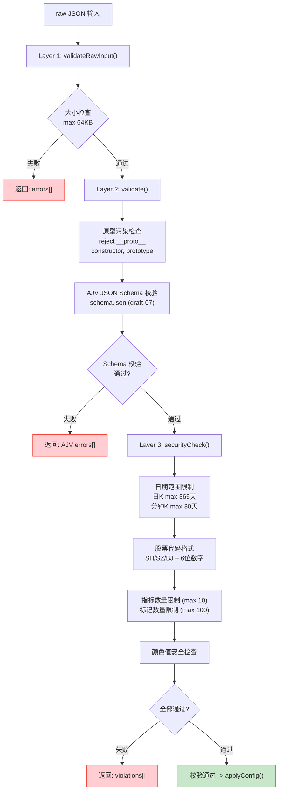

### 7.3 配置应用流程

`SemanticChartController.applyConfig()` (`src/semantic/controller.ts`)：

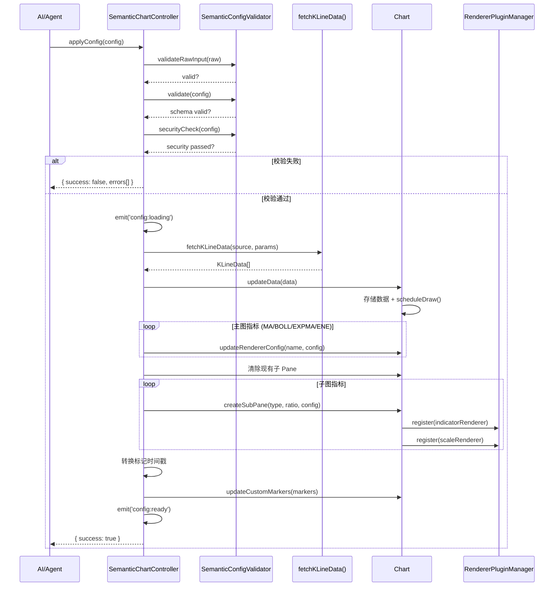

```
applyConfig(config)
  -> 校验 (3 层)
  -> doApplyConfig(config):
      1. fetchKLineData(config.data.source, params)  // 获取数据
      2. chart.updateData(data)                       // 注入图表
      3. 应用主图指标
         -> MA/BOLL/EXPMA/ENE -> chart.updateRendererConfig()
      4. 清除现有子 Pane，按 sub[] 创建新的
         -> chart.createSubPane(indicatorType, ratio, config)
      5. 转换标记时间戳 (日期字符串 -> 上海时区时间戳)
      6. chart.updateCustomMarkers(markers)
```

### 7.4 配置在渲染管线中的位置

```mermaid
graph LR
    subgraph Input["输入层"]
        JSON["SemanticChartConfig<br/>(JSON)"]
    end

    subgraph Validation["校验层"]
        V1["validateRawInput<br/>64KB 限制"]
        V2["validate<br/>原型污染 + AJV Schema"]
        V3["securityCheck<br/>日期/代码/数量/颜色"]
    end

    subgraph Application["应用层"]
        A1["fetchKLineData<br/>数据获取"]
        A2["chart.updateData<br/>数据注入"]
        A3["updateRendererConfig<br/>主图指标"]
        A4["createSubPane<br/>子图指标"]
        A5["updateCustomMarkers<br/>标记注入"]
    end

    subgraph Rendering["渲染层"]
        D1["Chart.draw()"]
        D2["RenderContext"]
        D3["各渲染器绘制"]
    end

    JSON --> V1 --> V2 --> V3
    V3 --> A1 --> A2 --> A3 --> A4 --> A5
    A5 --> D1 --> D2 --> D3

    style JSON fill:#e3f2fd,stroke:#2196F3
    style D3 fill:#fce4ec,stroke:#E91E63
```

配置是**单向数据流的源头**：SemanticChartConfig 驱动整个渲染管线，但渲染结果不会回写到配置。这种设计使得 AI/Agent 可以通过构造 JSON 配置来声明式地控制图表的完整外观和数据。

---

## 8. Canvas 物理像素、逻辑像素、DPR 的处理

### 8.1 DPR 发现机制

`Chart.getEffectiveDpr()` (`core/chart.ts` lines 246-252) 采用双源策略：

1. **首选**：`ResizeObserver` 的 `devicePixelContentBoxSize` -- 提供亚像素精度的 DPR（例如精确的 2.0），四舍五入到 1/64 精度
2. **回退**：`window.devicePixelRatio` -- 同样四舍五入到 1/64 精度，最小值 1

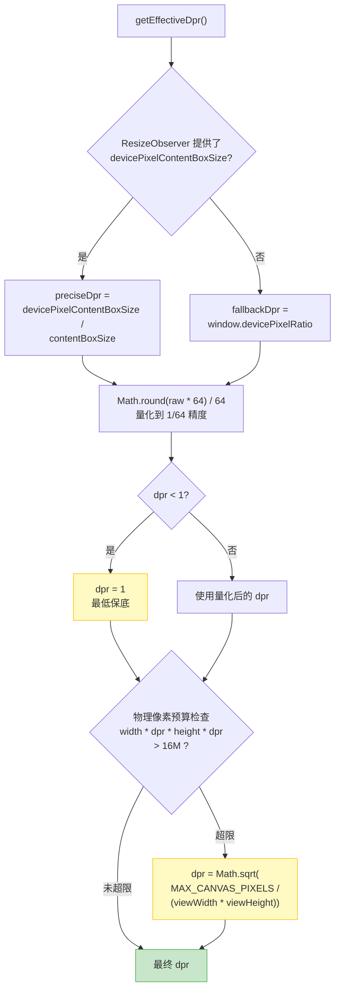

### 8.2 DPR 安全上限

`computeViewport()` 中设置 Canvas 像素预算上限：

```typescript
MAX_CANVAS_PIXELS = 16 * 1024 * 1024  // ~1600万像素
if (viewWidth * dpr * viewHeight * dpr > MAX_CANVAS_PIXELS) {
  dpr = Math.sqrt(MAX_CANVAS_PIXELS / (viewWidth * viewHeight))
}
```

防止超高 DPR 设备上 Canvas 缓冲区过大导致内存溢出。

### 8.3 Canvas 尺寸设定

`PaneRenderer.resize()` (`core/paneRenderer.ts` lines 47-61)：

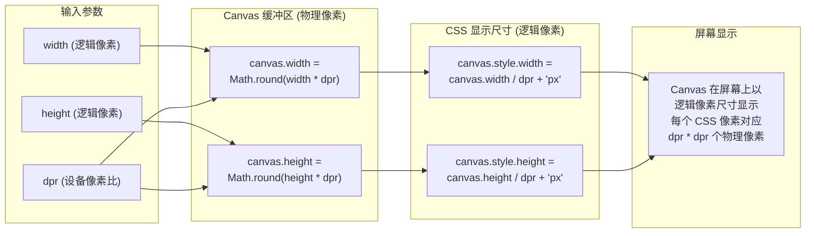

```typescript
// Canvas 缓冲区 = 物理像素
plotCanvas.width  = Math.round(width * dpr)
plotCanvas.height = Math.round(height * dpr)
// CSS 显示尺寸 = 逻辑像素
plotCanvas.style.width  = `${plotCanvas.width / dpr}px`
plotCanvas.style.height = `${plotCanvas.height / dpr}px`
```

这是经典的 DPR 感知 Canvas 尺寸模式：`.width/.height` 设置物理像素缓冲区大小，`.style.width/.style.height` 设置 CSS 逻辑像素显示大小。

### 8.4 渲染坐标变换

每帧绘制开始时：

```typescript
ctx.setTransform(1, 0, 0, 1, 0, 0)  // 重置变换矩阵
ctx.scale(dpr, dpr)                   // 缩放到逻辑坐标空间
ctx.clearRect(0, 0, width + 1, height + 2 / dpr)  // 清除画布 (+1px 右边界防残影)
```

所有渲染器在逻辑坐标系中绘制，Canvas 自动将逻辑坐标乘以 DPR 映射到物理像素。

### 8.5 滚动对齐

```typescript
const scrollLeft = Math.round(container.scrollLeft * dpr) / dpr
```

滚动位置被量化到物理像素边界，防止亚像素偏移导致全局渲染模糊。

---

## 9. ResizeObserver 如何保证清晰绘制

### 9.1 ResizeObserver 配置

`Chart.initResizeObserver()` (`core/chart.ts` lines 196-225)：

```mermaid
sequenceDiagram
    participant RO as ResizeObserver
    participant Chart
    participant Metrics as updateObservedMetrics
    participant VP as computeViewport
    participant LP as layoutPanes
    participant PR as PaneRenderer
    participant RAF as scheduleDraw

    RO->>Chart: callback(entries)
    Chart->>Metrics: 提取尺寸 + DPR
    Metrics-->>Chart: observedSize + preciseDpr

    alt 尺寸或 DPR 发生变化
        Chart->>VP: computeViewport()
        VP-->>Chart: 新 Viewport (含新 dpr)

        Chart->>LP: layoutPanes()
        loop 每个 PaneRenderer
            LP->>PR: resize(plotWidth, h, dpr)
            PR->>PR: canvas.width = Math.round(w * dpr)
            PR->>PR: canvas.style.width = w + 'px'
        end

        Chart->>RAF: scheduleDraw()
        RAF->>RAF: requestAnimationFrame -> draw()
    else 无变化
        Chart->>Chart: 跳过 resize
    end
```

```typescript
// 优先尝试 device-pixel-content-box 模式
this.resizeObserver.observe(target, {
  box: 'device-pixel-content-box' as ResizeObserverBoxOptions
})
// 不支持时静默回退到默认模式
```

`device-pixel-content-box` 模式提供以物理像素为单位的尺寸信息，是获取精确 DPR 的最佳途径。

### 9.2 指标提取 (`updateObservedMetrics()`)

```typescript
// CSS 逻辑像素尺寸
observedSize = { width: contentRect.width, height: contentRect.height }

// 精确 DPR = 物理像素尺寸 / 逻辑像素尺寸
preciseDpr = devicePixelContentBoxSize[0].inlineSize / contentBoxSize[0].inlineSize
// 四舍五入到 1/64 精度
preciseDpr = Math.round(raw * 64) / 64
```

### 9.3 变更检测

ResizeObserver 回调中比较当前与上一次的 width、height、DPR 三个值。任一发生变化即触发 `resize()` 流程：

```
ResizeObserver 触发
  -> updateObservedMetrics()
  -> 比较 (width !== prev || height !== prev || dpr !== prev)
  -> this.resize()
      -> computeViewport()          // 重新计算视口 + DPR
      -> layoutPanes()              // 重新分配 Pane 高度
      -> renderer.resize(w, h, dpr) // 重新设置 Canvas 尺寸
      -> scheduleDraw()             // RAF 调度重绘
```

### 9.4 防模糊保证的完整机制

ResizeObserver 只是清晰绘制的第一环。完整的防模糊体系由以下机制共同保证：

```mermaid
graph TB
    subgraph Ring1["第一环: DPR 精确获取"]
        direction LR
        R1A["ResizeObserver<br/>device-pixel-content-box"]
        R1B["量化: Math.round(raw * 64) / 64<br/>消除浮点噪声"]
        R1A --> R1B
    end

    subgraph Ring2["第二环: Canvas 尺寸正确"]
        direction LR
        R2A["缓冲区 = 逻辑尺寸 * DPR<br/>(物理像素)"]
        R2B["CSS = 缓冲区 / DPR<br/>(逻辑像素)"]
        R2C["Math.round()<br/>避免亚像素缓冲区"]
        R2A --> R2B --> R2C
    end

    subgraph Ring3["第三环: 坐标物理对齐"]
        direction LR
        R3A["roundToPhysicalPixel()<br/>Math.round(v * dpr) / dpr"]
        R3B["alignToPhysicalPixelCenter()<br/>(Math.floor(v * dpr) + 0.5) / dpr"]
        R3C["1px 线段矩形<br/>createVerticalLineRect()<br/>createHorizontalLineRect()"]
        R3A --- R3B --- R3C
    end

    subgraph Ring4["第四环: 烛图奇数宽度"]
        direction LR
        R4A["widthPx 强制奇数<br/>if (even) += 1"]
        R4B["影线居中<br/>wickX = left + (width-1)/2"]
        R4C["间隙恒定 3 物理像素<br/>kGap = 3 / dpr"]
        R4A --> R4B --> R4C
    end

    subgraph Ring5["第五环: 滚动位置量化"]
        direction LR
        R5A["scrollLeft =<br/>Math.round(scroll * dpr) / dpr"]
        R5B["消除亚像素平移偏移<br/>K线落在物理像素网格上"]
        R5A --> R5B
    end

    subgraph Ring6["第六环: 半像素偏移"]
        direction LR
        R6A["align = lineWidth <= 1<br/>? 0.5 / dpr : 0"]
        R6B["细线条落在单个<br/>物理像素行/列上"]
        R6A --> R6B
    end

    Ring1 -->|"精确 dpr"| Ring2
    Ring2 -->|"dpr 感知 Canvas"| Ring3
    Ring3 -->|"对齐坐标"| Ring4
    Ring4 -->|"对齐 K线宽度"| Ring5
    Ring5 -->|"对齐滚动"| Ring6
    Ring6 --> CL["清晰渲染 (Crisp Rendering)"]

    style CL fill:#c8e6c9,stroke:#4CAF50,stroke-width:2px
```

**第一环 -- DPR 精确获取 (ResizeObserver)：**
- `device-pixel-content-box` 提供物理像素级精度
- 1/64 精度量化消除浮点噪声

**第二环 -- Canvas 尺寸正确设定 (PaneRenderer.resize())：**
- 缓冲区尺寸 = 逻辑尺寸 * DPR（物理像素）
- CSS 尺寸 = 缓冲区 / DPR（逻辑像素）
- `Math.round()` 避免亚像素缓冲区

**第三环 -- 渲染坐标物理对齐 (pixelAlign.ts)：**
- `roundToPhysicalPixel(v, dpr) = Math.round(v * dpr) / dpr` -- 矩形填充对齐
- `alignToPhysicalPixelCenter(v, dpr) = (Math.floor(v * dpr) + 0.5) / dpr` -- 1px 线条居中对齐
- `createVerticalLineRect()` / `createHorizontalLineRect()` -- 1 物理像素宽/高的线段矩形

**第四环 -- 烛图奇数宽度保证 (createAlignedKLine)：**
- 实体宽度强制为奇数物理像素：`if (widthPx % 2 === 0) widthPx += 1`
- 影线 X = `leftPx + (widthPx - 1) / 2`，正好在实体中心的物理像素列上
- K 线间隙恒定 3 物理像素：`kGap = 3 / dpr`

**第五环 -- 滚动位置量化：**
- `scrollLeft = Math.round(container.scrollLeft * dpr) / dpr`
- 消除亚像素平移偏移，保证所有 K 线始终落在物理像素网格上

**第六环 -- 1px 线条半像素偏移：**
- 绘图工具中 `align = lineWidth <= 1 ? 0.5 / dpr : 0`
- 经典半像素偏移技巧，确保细线条落在单个物理像素行/列上

### 9.5 测试覆盖

项目针对这些机制有专门的测试：

| 测试文件 | 覆盖范围 |
|---------|---------|
| `chart.dpr.test.ts` | DPR 管线：精确 DPR、回退、钳制、像素预算上限、ResizeObserver 断开 |
| `paneRenderer.resize.test.ts` | Canvas 尺寸：逻辑->物理映射、CSS 尺寸设定 |
| `pixelAlign.spec.ts` | 像素对齐函数：DPR=1 和 DPR=2 下的行为 |
| `interaction.dpr.test.ts` | 交互控制器：DPR 感知的命中测试和十字线定位 |
| `physicalPixelZoom.spec.ts` | 各缩放级别下烛图宽度保持奇数物理像素 |

---

## 附录 A: 核心文件索引

| 模块 | 文件 | 行数(约) | 职责 |
|------|------|---------|------|
| 编排中枢 | `src/core/chart.ts` | 1252 | 视口计算、帧调度、K线坐标、布局 |
| Vue 组件 | `src/components/KLineChart.vue` | 1557 | 响应式状态、DOM 管理、渲染器注册 |
| Pane 管理 | `src/core/paneRenderer.ts` | 67 | Canvas DOM 管理、DPR 尺寸设定 |
| 像素对齐 | `src/core/draw/pixelAlign.ts` | 255 | 物理像素对齐工具库 |
| 渲染器管理 | `src/plugin/rendererPluginManager.ts` | ~250 | 渲染器注册/排序/调度/缓存 |
| 插件宿主 | `src/plugin/PluginHost.ts` | ~200 | 通用插件生命周期管理 |
| 价格变换 | `src/core/scale/priceScale.ts` | ~150 | 价格-坐标双向映射 |
| 可见范围 | `src/core/viewport/viewport.ts` | ~100 | K线可见索引范围 + 价格范围 |
| 烛图渲染 | `src/core/renderers/candle.ts` | ~150 | 烛图实体+影线绘制 |
| 语义配置 | `src/semantic/controller.ts` | ~150 | JSON 配置校验+应用管线 |
| 语义校验 | `src/semantic/validator.ts` | ~200 | AJV 校验 + 安全检查 |

## 附录 B: 关键设计模式总结

| 模式 | 应用位置 | 效果 |
|------|---------|------|
| Vue SSOT | zoomLevel 在 Vue ref 中持有 | Chart 无状态，便于测试和重用 |
| 优先级队列 | RendererPluginManager | 渲染顺序确定，覆盖关系可预测 |
| 错误隔离 | render() 中 try/catch per renderer | 单一渲染器异常不影响整帧 |
| 物理像素优先 | pixelAlign + K线奇数宽度 | 跨 DPR 清晰渲染 |
| 双 Canvas 分离 | plotCanvas + yAxisCanvas | Y轴脱离滚动容器，避免裁剪 |
| 缓存惰性重建 | groupCache + mergedCache | 插件变更时 O(1) 标记，渲染时 O(n) 重建 |
| 状态共享 | StateStore (namespace) | 指标渲染器 -> Scale 渲染器 解耦 |
| 离散缩放 | zoomLevel (1-N) 整数 | 避免浮点精度问题，缩放可预测 |
